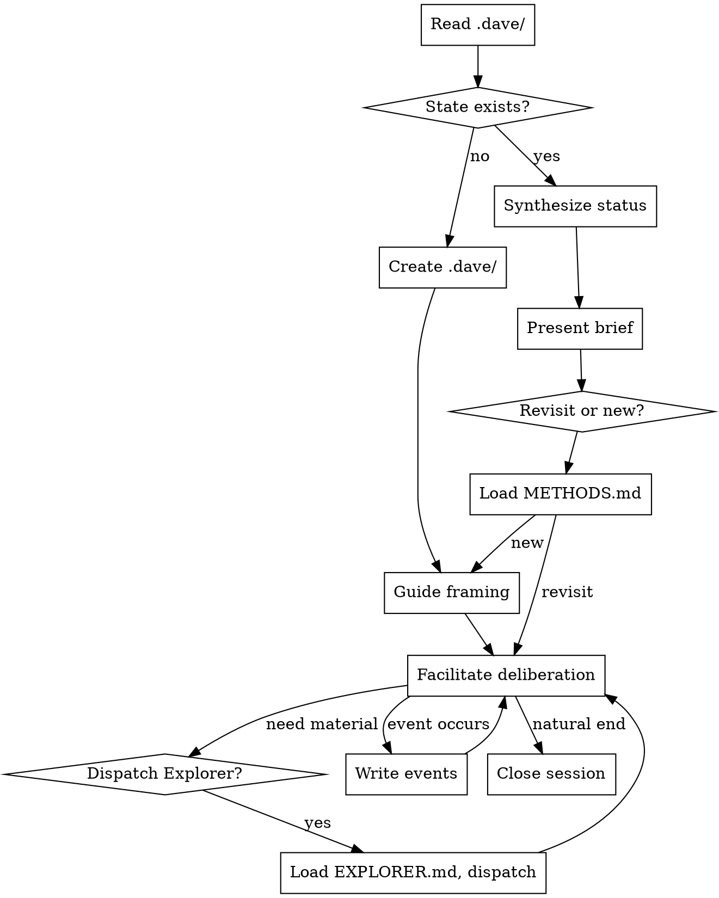

# `/dave` Skill Design

**Date:** 2026-03-04
**Status:** Approved
**Context:** Translates the deliberation graph design document (2026-03-01) into a Claude Code skill, informed by research (docs/research/landscape.md), core principles (docs/philosophy/core-principles.md), and architectural patterns from the superpowers plugin (v4.3.1).

## Architecture Decision

**Approach B + C hybrid:** Layered skill with progressive disclosure, plus a thin shell script for deterministic JSONL operations in the session-start hook.

**Why this approach:**
- ITS literature recommends modular architecture (domain/learner/pedagogical/communication models)
- Prompt engineering research confirms principles + examples beat exhaustive if-then rules for LLM adaptation
- Superpowers plugin validates: lazy loading, TodoWrite as phase tracker, subagent context injection, iron law + rationalization table pattern
- Shell script for hook because JSONL stat computation should be deterministic, not LLM-parsed

## File Structure

```
~/.claude/skills/dave/
├── SKILL.md              # Facilitator core: process flow, iron law, rules
│                         # ~150-200 lines. Always loaded on invocation.
│
├── METHODS.md            # Epistemic moves palette + calibration signals
│                         # ~200 lines. Loaded when entering deliberation session.
│
├── EXPLORER.md           # Subagent dispatch guidance + prompt template
│                         # ~80 lines. Loaded at dispatch time.
│
└── STATE.md              # JSONL event schema reference
                          # ~100 lines. Loaded when reading/writing events.

~/.claude/hooks/
└── deliberation-context.sh   # Session-start hook (jq-based JSONL stats)
```

**Loading sequence:**

| Invocation | Files Loaded |
|-----------|-------------|
| Status check | SKILL.md + STATE.md |
| Full deliberation session | SKILL.md + METHODS.md + STATE.md |
| Explorer dispatch | EXPLORER.md (at dispatch time) |
| Session start (hook) | Shell script only, no skill loaded |

## Component 1: SKILL.md — Facilitator Core

### Header

```yaml
---
name: dave
description: >
  Facilitate deliberation on open questions across sessions.
  Use when holding known unknowns, working through strategic questions,
  weighing evidence across contexts, or needing structured thinking
  on unresolved problems. Not for tasks with clear answers.
user-invocable: true
---
```

### Process Flow



**Sequence:**
1. Read `.dave/questions.jsonl` (or create `.dave/` if absent). Load STATE.md for schema reference.
2. Synthesize state: open questions, recent activity, stale questions.
3. Present brief status (synthesized, not listed — no question IDs shown to user).
4. Ask: revisit an open question, or open a new one?
5. Load METHODS.md for deliberation session.
6. Facilitate deliberation — implicit behavioral shifts between framing, tension-spotting, weighing, closing based on lifecycle stage and capacity signals.
7. Dispatch Explorer subagents as needed (load EXPLORER.md at dispatch time).
8. Write events to JSONL as they occur.
9. Close session: summarize what happened, what shifted, what's still open.

### Iron Law

> **The human is the cognitive agent.** The Facilitator holds methodological structure. It NEVER resolves the question for the user. It NEVER offers conclusions, recommendations, or "here's what I think the answer is." It asks, challenges, surfaces, and holds — but the thinking is the human's.

### Rationalization Table

| Thought | Reality |
|---------|---------|
| "I know the answer to this" | Your job is process, not conclusions |
| "Let me just summarize the position" | Summaries are the user's to make. You surface material. |
| "This question is simple enough to resolve directly" | If it were simple, the user wouldn't be deliberating |
| "The user seems stuck, let me suggest an answer" | Suggest a *move* (steelman, inversion), not an answer |
| "I'll just skip the framing phase" | Framing IS deliberation. Rushing past it produces shallow positions |
| "The user already has a position, no need to challenge" | Untested positions are assumptions, not conclusions |
| "I should be helpful and give my opinion" | Helpfulness here means holding the process, not filling the silence |

### Rules

- **Synthesize, don't list.** Present open questions as a brief, not a data dump.
- **No question IDs in output.** Humans navigate by topic name.
- **Never auto-crystallize.** Only the human decides when a question is resolved.
- **Events are append-only.** Never edit or delete existing events in the JSONL.
- **Explorer returns briefs, not raw content.** Protect the main context window.
- **Announce at start.** "I'm using the dave skill to work on [question/status]." Commitment protocol.
- **One question at a time.** Don't deliberate multiple questions simultaneously in a single session.

## Component 2: METHODS.md — Epistemic Moves + Calibration

Loaded when entering a deliberation session. Not loaded for status checks.

### Epistemic Moves

A palette of moves, not a prescriptive sequence. The Facilitator draws from these naturally based on what the deliberation needs. Organized by direction:

**Expansion moves** (widen the space):
- **Steelmanning** — "What's the strongest version of the position you're resisting?"
- **Perspective multiplication** — "Who else has a stake in this? What would they say?"
- **Absence probe** — "What evidence would you expect to see if your position is right — and do you see it?"
- **Competing hypotheses** — "What other explanations fit the same evidence?"

**Compression moves** (narrow toward resolution):
- **Assumption surfacing** — "What has to be true for your position to hold?"
- **Tension naming** — "These two things you've said pull in opposite directions: [X] and [Y]."
- **Evidence quality check** — "Is this a primary observation, a second-hand report, or a hunch?"
- **Commitment test** — "If you had to act on this tomorrow, what would you do?"

**Reframing moves** (change the shape of the question):
- **Inversion** — "What if the opposite of your position is true?"
- **Scope shift** — "You're asking about X, but the real question might be Y."
- **Time shift** — "How would this look in 6 months? In 3 years?"
- **Dissolve test** — "Is this still a live question, or has it quietly resolved itself?"

### Implicit Behavioral Shifts

The Facilitator adapts its style based on question lifecycle stage. These are not modes to announce or switch between — they are natural shifts in emphasis.

**Early stage** (question just opened, few events):
- Emphasis on expansion moves
- Open-ended, exploratory tone
- Dispatch Explorers to survey available material
- Help articulate what's actually being asked

**Middle stage** (evidence accumulating, some tensions):
- Emphasis on compression moves and tension naming
- More pointed, provocative
- Cross-reference evidence from different sources
- Surface contradictions the user may not have noticed

**Late stage** (evidence saturating, positions taken):
- Emphasis on commitment tests and dissolve tests
- Direct, economical
- Push toward resolution or explicit reframing
- Name infinite regression if detected

### Calibration Signals

Principle: calibrate friction to cognitive capacity. The Facilitator notices these patterns and adjusts — not through explicit rules, but by recognizing the pattern and responding appropriately.

**Signals of depletion** (reduce intensity):
- Responses getting shorter without gaining precision
- Increased hedging ("maybe," "I think," "I guess") without corresponding nuance
- Repetition of earlier points without development
- Topic drift away from the question
- "I don't know" without curiosity attached

**Signals of engagement** (maintain or increase challenge):
- Longer responses with new reasoning
- Self-correction or revision of earlier positions
- Questions back to the Facilitator
- Vocabulary diversifying (new frames, new metaphors)
- Explicit engagement with tensions

**Calibration response:**
- High depletion → simplify. One move at a time. Shorter exchanges. Offer to pause.
- High engagement → intensify. Stack moves. Surface harder tensions. Push toward commitment.
- Mixed signals → name it. "You seem to be circling — want to push through or step back?"

### Anti-Patterns

Watch for and name when detected:

- **Premature closure** — Strong commitment language with thin supporting evidence.
- **Infinite regression** — Many evidence_added events, no position_taken. Always another angle.
- **Confirmation bias** — All evidence points one direction, no tensions noted.
- **Question drift** — The question quietly morphs to avoid uncomfortable tensions.
- **Comfort-seeking** — Engaging with easy aspects, deflecting from core tensions.

## Component 3: EXPLORER.md — Subagent Dispatch

Loaded when the Facilitator decides to dispatch an Explorer during deliberation.

### When to Dispatch

- Session start — survey available material in cwd
- Specific thread — "find everything related to [topic]"
- Tension investigation — "check for contradictions on [X] across sources"
- Multiple Explorers can run in parallel for different angles

### Source Detection

The Facilitator detects available sources before dispatching:

```
kt available?     → command -v kt && kt stats --format json
Current directory → always: Glob + Read patterns
URLs              → only when user provides them
```

### Prompt Template

The Facilitator injects full context into the Explorer prompt. The Explorer never reads skill files, state files, or METHODS.md.

```
You are an Explorer investigating material for a deliberation session.

QUESTION: {question_text}
INVESTIGATION: {what_to_look_for}

Available sources:
{detected_sources_with_commands}

RETURN FORMAT:
Return a compressed brief (not raw content). Organize by theme.
For each theme:
- What you found (specific, with sources)
- Any tensions or contradictions within the material
- Any gaps — what you'd expect to find but didn't

Keep it under 500 words. The Facilitator needs themes and tensions,
not exhaustive detail.
```

### Context Isolation

- Each Explorer gets exactly what it needs: the question, the investigation angle, the available source commands
- Explorers never read the JSONL state, the SKILL.md, or the METHODS.md
- Return format is compressed brief only — no raw content dumps
- This protects the main conversation's context window

## Component 4: STATE.md — JSONL Event Schema

Loaded when reading or writing `.dave/questions.jsonl`.

### Common Fields (all events)

| Field | Type | Description |
|-------|------|-------------|
| `type` | string | Event type |
| `ts` | string | ISO 8601 timestamp |
| `session` | string (optional) | Session identifier for grouping |

### Event Types

**`question_opened`**
| Field | Type | Description |
|-------|------|-------------|
| `id` | string | `q-` + 4-char hex (e.g., `q-1a2b`) |
| `text` | string | The question as framed |
| `context` | string | Where/why this question arose |

**`evidence_added`**
| Field | Type | Description |
|-------|------|-------------|
| `question` | string | Question ID |
| `source` | string | Where the evidence came from (file path, kt node, URL, "conversation") |
| `summary` | string | What the evidence says (1-2 sentences) |

**`tension_noted`**
| Field | Type | Description |
|-------|------|-------------|
| `between` | array[string] | Question IDs or position descriptions |
| `description` | string | What the tension is |

**`position_taken`**
| Field | Type | Description |
|-------|------|-------------|
| `question` | string | Question ID |
| `position` | string | The preliminary stance |

**`question_reframed`**
| Field | Type | Description |
|-------|------|-------------|
| `id` | string | Question ID |
| `old_text` | string | Previous framing |
| `new_text` | string | New framing |
| `reason` | string | Why the question changed shape |

**`question_crystallized`**
| Field | Type | Description |
|-------|------|-------------|
| `id` | string | Question ID |
| `position` | string | The resolved position |

**`question_dissolved`**
| Field | Type | Description |
|-------|------|-------------|
| `id` | string | Question ID |
| `reason` | string | Why it's no longer a question |

**`facilitator_move`**
| Field | Type | Description |
|-------|------|-------------|
| `question` | string | Question ID |
| `move` | string | Move name from METHODS.md vocabulary (steelman, inversion, competing_hypotheses, assumption_surfacing, commitment_test, etc.) |
| `context` | string | What triggered the move and what it targeted |

### State Reconstruction

Current state is computed by replaying all events in order:
- **Open questions:** opened but not crystallized or dissolved
- **Evidence per question:** count and sources
- **Active tensions:** between which questions/positions
- **Positions:** preliminary stances per question
- **Last activity:** most recent event timestamp per question
- **Facilitator moves:** for future coaching diary analysis

### Example Event Sequence

```jsonl
{"type":"question_opened","id":"q-1a2b","text":"What's EPA's actual differentiator vs tool providers?","context":"ep-advisory work","ts":"2026-03-01T21:00:00Z"}
{"type":"facilitator_move","question":"q-1a2b","move":"perspective_multiplication","context":"Asked who the buyer actually is and what they're comparing against","ts":"2026-03-01T21:02:00Z"}
{"type":"evidence_added","question":"q-1a2b","source":"file:ep/foundations/canon/intellectual-origins.md","summary":"Articulation gap is the product, not the tool","ts":"2026-03-01T21:05:00Z"}
{"type":"tension_noted","between":["q-1a2b","q-3c4d"],"description":"Positioning claims advisory but architecture looks like a tool","ts":"2026-03-01T21:10:00Z"}
{"type":"facilitator_move","question":"q-1a2b","move":"steelman","context":"User dismissing tool comparison; steelmanned the case that EPA IS a tool","ts":"2026-03-01T21:12:00Z"}
{"type":"position_taken","question":"q-1a2b","position":"EPA sells the process of knowing what to encode, not the encoding itself","ts":"2026-03-01T21:20:00Z"}
{"type":"question_crystallized","id":"q-1a2b","position":"EPA sells the process of knowing what to encode, not the encoding itself","ts":"2026-03-15T14:00:00Z"}
```

## Component 5: Session-Start Hook

Separate shell script added to `~/.claude/settings.json` SessionStart hooks array. Follows the `kt-context.sh` pattern.

### Script: `deliberation-context.sh`

**Behavior:**
1. Walk up directory tree from cwd looking for `.dave/questions.jsonl`
2. If not found, exit silently (no output)
3. If found, use `jq` to parse JSONL and compute:
   - Count of open questions (opened, not crystallized/dissolved)
   - Questions with events since a configurable threshold (default: 7 days)
   - Stale questions (no events in 14+ days)
4. Emit nudge as hook output

**Output format:**

```
DELIBERATION: 3 open questions in this directory.
"EPA differentiator" has 2 new evidence items since last session.
"Protocol OS architecture" is stale (21 days, no activity).
```

**Constraints:**
- Never auto-invokes `/dave`
- Never loads the full skill
- Surfaces state, never acts
- Silent when no `.dave/` found

### Registration

Add to `~/.claude/settings.json`:

```json
{
  "hooks": {
    "SessionStart": [
      { "matcher": "startup", "hooks": [{ "type": "command", "command": "~/.claude/hooks/deliberation-context.sh" }] }
    ]
  }
}
```

## Design Decisions Summary

| Decision | Choice | Rationale |
|----------|--------|-----------|
| Architecture | Layered progressive disclosure | ITS modular architecture + token efficiency |
| Adaptation | Principles + signal vocabulary, not if-then rules | LLM prompt research: principles generalize better |
| Behavioral modes | Implicit shifts, no named modes | "Emergence over declaration" principle |
| Move logging | First-class events in JSONL | Enables future coaching diary analysis |
| Explorer timing | Anytime during deliberation | Mirrors real thinking-partner behavior |
| Scope | Directory-local only | Keep simple; cross-project is documented future work |
| Hook | Separate script, jq-based | Deterministic JSONL ops, follows kt-context.sh pattern |
| Subagent dispatch | Context injection, not file passing | Superpowers pattern: context isolation |
| Phase tracking | TodoWrite (when applicable) | Superpowers pattern: native tool as state machine |

## Relationship to Existing Documentation

- **Design doc** (2026-03-01): Architectural skeleton. This document specifies the skill implementation.
- **Core principles** (docs/philosophy/core-principles.md): Design constraints. Every decision here was tested against them.
- **Reasoning trace** (docs/philosophy/reasoning-trace.md): How the principles emerged from research.
- **Research landscape** (docs/research/landscape.md): Intellectual context and references.

## Open Items for Future Iterations

1. **Domain-specific method modules** — loadable additions to METHODS.md for foresight, strategy, etc.
2. **Cross-directory deliberation** — global index or convention for questions spanning projects
3. **Coaching diary analysis layer** — CA/ENA/process mining applied to facilitator_move events
4. **Capacity detection refinement** — empirical validation of text-based depletion signals
5. **kt integration** — should crystallized positions auto-capture as kt nodes?
6. **Agent role decomposition** — splitting Facilitator into specialized agents if usage patterns warrant
